# JobFind Chen-Style ER Diagram

This version uses Chen-style ER notation:

- Rectangle = entity/table
- Oval = attribute/column
- Diamond = relationship
- Edge labels = cardinality or role

```mermaid
flowchart LR
    classDef entity fill:#fff,stroke:#111,stroke-width:1px,color:#111;
    classDef attribute fill:#fff,stroke:#111,stroke-width:1px,color:#111;
    classDef relation fill:#fff,stroke:#111,stroke-width:1px,color:#111;

    U[Users]:::entity
    U_user_id([user_id PK]):::attribute
    U_username([username]):::attribute
    U_email([email]):::attribute
    U_password([password]):::attribute
    U_fullname([fullname]):::attribute
    U_phone([phone]):::attribute
    U_gender([gender]):::attribute
    U_role([role]):::attribute
    U_latitude([latitude]):::attribute
    U_longitude([longitude]):::attribute
    U_profile_image([profile_image]):::attribute
    U_created_at([created_at]):::attribute

    U_user_id --- U
    U_username --- U
    U_email --- U
    U_password --- U
    U_fullname --- U
    U_phone --- U
    U_gender --- U
    U_role --- U
    U_latitude --- U
    U_longitude --- U
    U_profile_image --- U
    U_created_at --- U

    EP[Employer_Profile]:::entity
    EP_employer_id([employer_id PK]):::attribute
    EP_user_id([user_id FK]):::attribute
    EP_employer_name([employer_name]):::attribute
    EP_description([employer_description]):::attribute
    EP_address([address/province/district]):::attribute
    EP_geo([latitude/longitude]):::attribute
    EP_like_count([like_count]):::attribute

    EP_employer_id --- EP
    EP_user_id --- EP
    EP_employer_name --- EP
    EP_description --- EP
    EP_address --- EP
    EP_geo --- EP
    EP_like_count --- EP

    FP[Freelancer_Profile]:::entity
    FP_freelancer_id([freelancer_id PK]):::attribute
    FP_user_id([user_id FK]):::attribute
    FP_skill([skill]):::attribute
    FP_experience([experience]):::attribute
    FP_age([age]):::attribute
    FP_location([location/address]):::attribute
    FP_geo([latitude/longitude]):::attribute
    FP_rating([rating]):::attribute

    FP_freelancer_id --- FP
    FP_user_id --- FP
    FP_skill --- FP
    FP_experience --- FP
    FP_age --- FP
    FP_location --- FP
    FP_geo --- FP
    FP_rating --- FP

    J[Job]:::entity
    J_job_id([job_id PK]):::attribute
    J_employer_id([employer_id FK]):::attribute
    J_title([title]):::attribute
    J_description([description]):::attribute
    J_location([location]):::attribute
    J_salary([salary]):::attribute
    J_deadline([deadline]):::attribute
    J_status([status]):::attribute
    J_admin_status([admin_status]):::attribute
    J_category([category]):::attribute
    J_job_subcategory([job_subcategory]):::attribute
    J_employment_type([employment_type]):::attribute

    J_job_id --- J
    J_employer_id --- J
    J_title --- J
    J_description --- J
    J_location --- J
    J_salary --- J
    J_deadline --- J
    J_status --- J
    J_admin_status --- J
    J_category --- J
    J_job_subcategory --- J
    J_employment_type --- J

    JA[Job_Application]:::entity
    JA_application_id([application_id PK]):::attribute
    JA_job_id([job_id FK]):::attribute
    JA_freelancer_id([freelancer_id FK]):::attribute
    JA_apply_date([apply_date]):::attribute
    JA_status([status]):::attribute

    JA_application_id --- JA
    JA_job_id --- JA
    JA_freelancer_id --- JA
    JA_apply_date --- JA
    JA_status --- JA

    R[Resume]:::entity
    R_resume_id([resume_id PK]):::attribute
    R_freelancer_id([freelancer_id FK]):::attribute
    R_file_name([file_name]):::attribute
    R_upload_date([upload_date]):::attribute

    R_resume_id --- R
    R_freelancer_id --- R
    R_file_name --- R
    R_upload_date --- R

    JI[Job_Images]:::entity
    JI_image_id([image_id PK]):::attribute
    JI_job_id([job_id FK]):::attribute
    JI_image_path([image_path]):::attribute
    JI_sort_order([sort_order]):::attribute

    JI_image_id --- JI
    JI_job_id --- JI
    JI_image_path --- JI
    JI_sort_order --- JI

    SF[Saved_Freelancers]:::entity
    SF_id([id PK]):::attribute
    SF_employer_id([employer_id FK]):::attribute
    SF_freelancer_id([freelancer_id FK]):::attribute
    SF_saved_at([saved_at]):::attribute

    SF_id --- SF
    SF_employer_id --- SF
    SF_freelancer_id --- SF
    SF_saved_at --- SF

    LE[Like_Employer]:::entity
    LE_like_id([like_id PK]):::attribute
    LE_freelancer_id([freelancer_id FK]):::attribute
    LE_employer_id([employer_id FK]):::attribute
    LE_created_at([created_at]):::attribute

    LE_like_id --- LE
    LE_freelancer_id --- LE
    LE_employer_id --- LE
    LE_created_at --- LE

    CM[Chat_Messages]:::entity
    CM_message_id([message_id PK]):::attribute
    CM_sender_id([sender_id FK]):::attribute
    CM_receiver_id([receiver_id FK]):::attribute
    CM_message([message]):::attribute
    CM_sent_at([sent_at]):::attribute
    CM_is_read([is_read]):::attribute

    CM_message_id --- CM
    CM_sender_id --- CM
    CM_receiver_id --- CM
    CM_message --- CM
    CM_sent_at --- CM
    CM_is_read --- CM

    ER[Employer_Review]:::entity
    ER_review_id([review_id PK]):::attribute
    ER_employer_id([employer_id FK]):::attribute
    ER_freelancer_id([freelancer_id FK]):::attribute
    ER_job_id([job_id FK]):::attribute
    ER_rating([rating]):::attribute
    ER_comment([comment]):::attribute

    ER_review_id --- ER
    ER_employer_id --- ER
    ER_freelancer_id --- ER
    ER_job_id --- ER
    ER_rating --- ER
    ER_comment --- ER

    FR[Freelancer_Review]:::entity
    FR_review_id([review_id PK]):::attribute
    FR_freelancer_id([freelancer_id FK]):::attribute
    FR_job_id([job_id FK]):::attribute
    FR_employer_id([employer_id FK]):::attribute
    FR_rating([rating]):::attribute
    FR_comment([comment]):::attribute

    FR_review_id --- FR
    FR_freelancer_id --- FR
    FR_job_id --- FR
    FR_employer_id --- FR
    FR_rating --- FR
    FR_comment --- FR

    ERate[Employer_Rating]:::entity
    ERate_rating_id([rating_id PK]):::attribute
    ERate_employer_id([employer_id FK]):::attribute
    ERate_freelancer_id([freelancer_id FK]):::attribute
    ERate_score([score]):::attribute

    ERate_rating_id --- ERate
    ERate_employer_id --- ERate
    ERate_freelancer_id --- ERate
    ERate_score --- ERate

    FRate[Freelancer_Rating]:::entity
    FRate_rating_id([rating_id PK]):::attribute
    FRate_freelancer_id([freelancer_id FK]):::attribute
    FRate_employer_id([employer_id FK]):::attribute
    FRate_score([score]):::attribute

    FRate_rating_id --- FRate
    FRate_freelancer_id --- FRate
    FRate_employer_id --- FRate
    FRate_score --- FRate

    C[Categories]:::entity
    C_category_id([category_id PK]):::attribute
    C_name([name]):::attribute
    C_icon([icon]):::attribute
    C_description([description]):::attribute

    C_category_id --- C
    C_name --- C
    C_icon --- C
    C_description --- C

    JS[Job_Subcategories]:::entity
    JS_subcategory_id([subcategory_id PK]):::attribute
    JS_category_id([category_id FK]):::attribute
    JS_name([name]):::attribute

    JS_subcategory_id --- JS
    JS_category_id --- JS
    JS_name --- JS

    CSR[Category_Seed_Runs]:::entity
    CSR_seed_key([seed_key PK]):::attribute
    CSR_applied_at([applied_at]):::attribute

    CSR_seed_key --- CSR
    CSR_applied_at --- CSR

    HAS_EMP{Has}:::relation
    HAS_FREE{Has}:::relation
    POSTS{Posts}:::relation
    HAS_IMG{Has}:::relation
    SUBMITS{Submits}:::relation
    FOR_JOB{For}:::relation
    UPLOADS{Uploads}:::relation
    SAVES{Saves}:::relation
    SAVED_TARGET{Saved Target}:::relation
    LIKES{Likes}:::relation
    LIKED_TARGET{Liked Target}:::relation
    SENDS{Sends}:::relation
    RECEIVES_MSG{Receives}:::relation
    WRITES_ER{Writes}:::relation
    RECEIVES_ER{Receives}:::relation
    ER_FOR_JOB{For Job}:::relation
    WRITES_FR{Writes}:::relation
    RECEIVES_FR{Receives}:::relation
    FR_FOR_JOB{For Job}:::relation
    GIVES_ERATE{Gives}:::relation
    RECEIVES_ERATE{Receives}:::relation
    GIVES_FRATE{Gives}:::relation
    RECEIVES_FRATE{Receives}:::relation
    CONTAINS{Contains}:::relation
    CLASS_CAT{Classified As}:::relation
    CLASS_SUBCAT{Subclassified As}:::relation
    SEEDS{Seeds}:::relation

    U ---|1| HAS_EMP
    HAS_EMP ---|0..1| EP

    U ---|1| HAS_FREE
    HAS_FREE ---|0..1| FP

    U ---|1 employer| POSTS
    POSTS ---|N| J

    J ---|1| HAS_IMG
    HAS_IMG ---|N| JI

    U ---|1 freelancer| SUBMITS
    SUBMITS ---|N| JA
    J ---|1| FOR_JOB
    FOR_JOB ---|N| JA

    U ---|1 freelancer| UPLOADS
    UPLOADS ---|N| R

    U ---|1 employer| SAVES
    SAVES ---|N| SF
    U ---|1 freelancer| SAVED_TARGET
    SAVED_TARGET ---|N| SF

    U ---|1 freelancer| LIKES
    LIKES ---|N| LE
    U ---|1 employer| LIKED_TARGET
    LIKED_TARGET ---|N| LE

    U ---|1 sender| SENDS
    SENDS ---|N| CM
    U ---|1 receiver| RECEIVES_MSG
    RECEIVES_MSG ---|N| CM

    U ---|1 freelancer| WRITES_ER
    WRITES_ER ---|N| ER
    U ---|1 employer| RECEIVES_ER
    RECEIVES_ER ---|N| ER
    J ---|0..1| ER_FOR_JOB
    ER_FOR_JOB ---|N| ER

    U ---|1 employer| WRITES_FR
    WRITES_FR ---|N| FR
    U ---|1 freelancer| RECEIVES_FR
    RECEIVES_FR ---|N| FR
    J ---|0..1| FR_FOR_JOB
    FR_FOR_JOB ---|N| FR

    U ---|1 freelancer| GIVES_ERATE
    GIVES_ERATE ---|N| ERate
    U ---|1 employer| RECEIVES_ERATE
    RECEIVES_ERATE ---|N| ERate

    U ---|1 employer| GIVES_FRATE
    GIVES_FRATE ---|N| FRate
    U ---|1 freelancer| RECEIVES_FRATE
    RECEIVES_FRATE ---|N| FRate

    C ---|1| CONTAINS
    CONTAINS ---|N| JS

    C ---|0..1 by name| CLASS_CAT
    CLASS_CAT ---|N| J

    JS ---|0..1 by name| CLASS_SUBCAT
    CLASS_SUBCAT ---|N| J

    CSR ---|1| SEEDS
    SEEDS ---|N| C
```

## Important Mapping Detail

In the PHP code, most columns named `employer_id` and `freelancer_id` point to `Users.user_id`.
The profile tables also have their own primary keys, but the application usually joins jobs, applications, reviews, likes, saves, resumes, and chat messages directly through `Users.user_id`.

