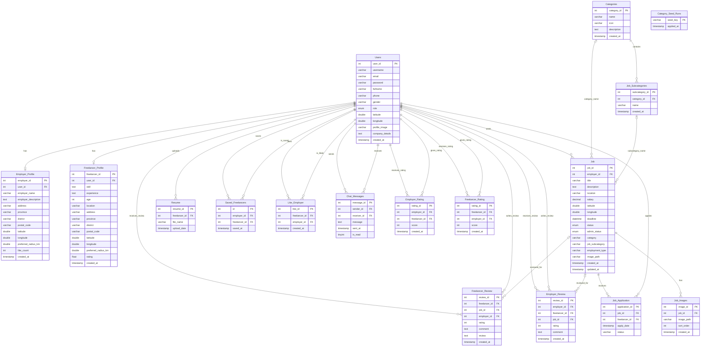

# JobFind ER Diagram

Chen-style version with rectangles, ovals, diamonds, and cardinality labels:
[`ER_CHEN_DIAGRAM.md`](ER_CHEN_DIAGRAM.md)

Generated from:

- `database/jobfind.sql`
- `migrations/*.sql`
- runtime schema helpers in `helpers/*_schema.php`, `helpers/category_helpers.php`, and `helpers/job_image_helpers.php`
- PHP query usage across `admin/`, `employer/`, `freelancer/`, `actions/`, `support/`, `helpers/`, and `services/`

Note: several columns named `employer_id` or `freelancer_id` store `Users.user_id` directly. The database dump only declares some foreign keys; this diagram includes both declared database relationships and logical relationships used by the application code.

## Relationship Notes

- Declared database FKs in `database/jobfind.sql`:
  - `Job.employer_id -> Users.user_id`
  - `Job_Images.job_id -> Job.job_id`
  - `Employer_Review.job_id -> Job.job_id`
  - `Saved_Freelancers.employer_id -> Users.user_id`
  - `Saved_Freelancers.freelancer_id -> Users.user_id`
- Logical relationships used by the PHP code but not fully enforced by FK constraints:
  - `Employer_Profile.user_id -> Users.user_id`
  - `Freelancer_Profile.user_id -> Users.user_id`
  - `Job_Application.job_id -> Job.job_id`
  - `Job_Application.freelancer_id -> Users.user_id`
  - `Resume.freelancer_id -> Users.user_id`
  - `Like_Employer.employer_id -> Users.user_id`
  - `Like_Employer.freelancer_id -> Users.user_id`
  - `Chat_Messages.sender_id -> Users.user_id`
  - `Chat_Messages.receiver_id -> Users.user_id`
  - `Employer_Review.employer_id -> Users.user_id`
  - `Employer_Review.freelancer_id -> Users.user_id`
  - `Freelancer_Review.employer_id -> Users.user_id`
  - `Freelancer_Review.freelancer_id -> Users.user_id`
  - `Freelancer_Review.job_id -> Job.job_id`
  - `Job_Subcategories.category_id -> Categories.category_id`
  - `Job.category -> Categories.name`
  - `Job.job_subcategory -> Job_Subcategories.name`
